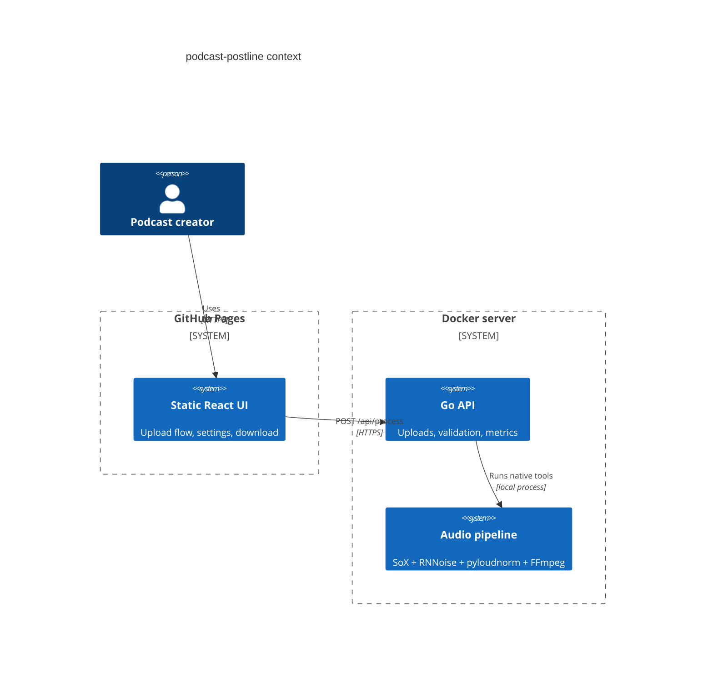

# podcast-postline


Live site: https://baditaflorin.github.io/podcast-postline/

Repository: https://github.com/baditaflorin/podcast-postline

Support: https://www.paypal.com/paypalme/florinbadita

`podcast-postline` is a self-hosted podcast post-production line: upload a raw recording, denoise with RNNoise, normalize to `-16 LUFS` with `pyloudnorm`, trim silence with SoX, and export with FFmpeg.


## Quickstart

```sh
npm install
make install-hooks
make build
PROCESSOR_MODE=stub go run ./cmd/server
npm run dev
```

## Production Backend

```sh
docker compose -f deploy/docker-compose.yml pull
docker compose -f deploy/docker-compose.yml up -d
```

The backend image is published as `ghcr.io/baditaflorin/podcast-postline:latest` after `make docker-push`.

## Architecture



Architecture docs: https://github.com/baditaflorin/podcast-postline/blob/main/docs/architecture.md

ADRs: https://github.com/baditaflorin/podcast-postline/tree/main/docs/adr

API docs: https://github.com/baditaflorin/podcast-postline/blob/main/docs/api.md

Deploy guide: https://github.com/baditaflorin/podcast-postline/blob/main/deploy/README.md

## Local Checks

```sh
make fmt
make lint
make test
make smoke
```

`make build` writes the GitHub Pages app into `docs/` and builds the Go server into `bin/postline-server`.
