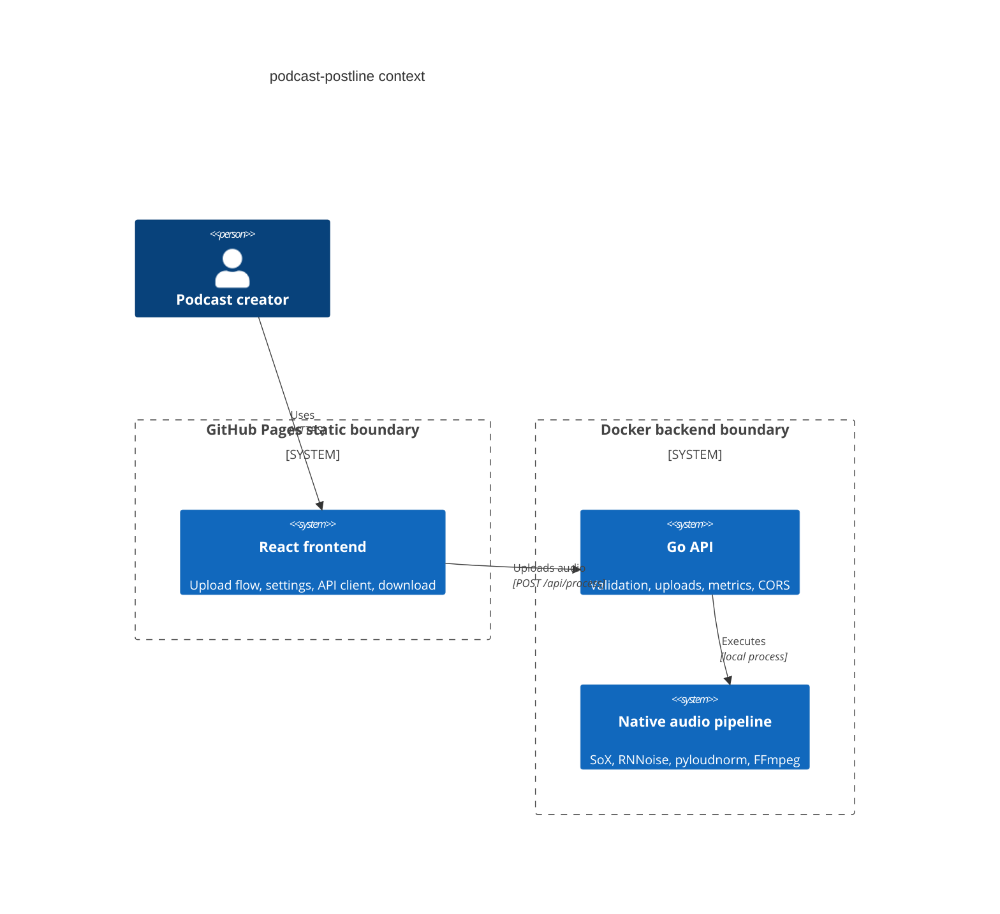
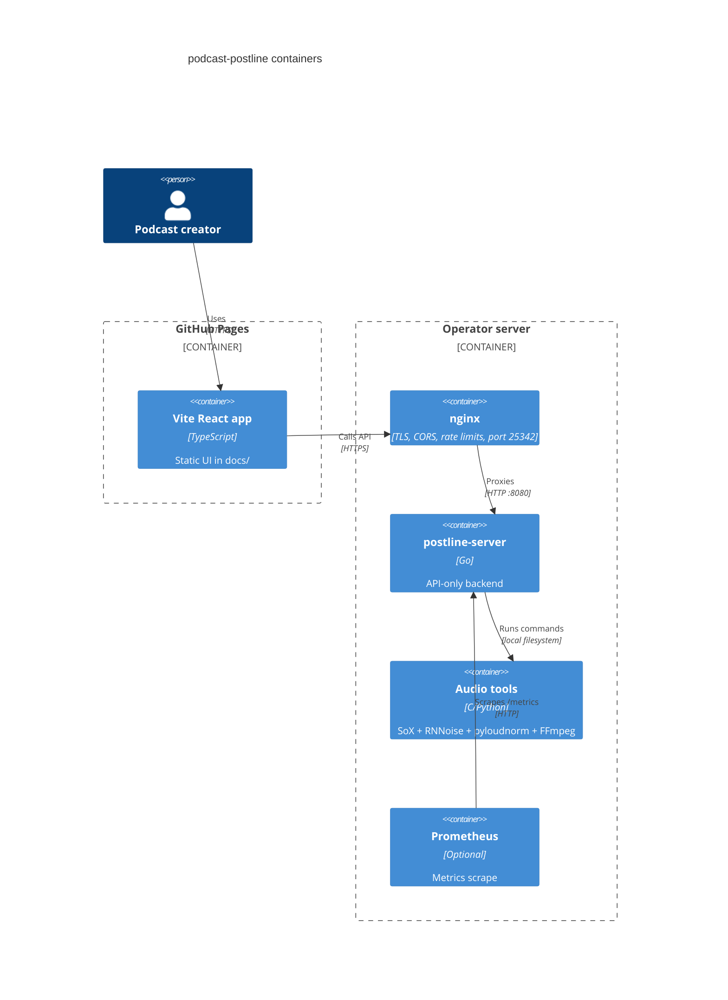

# Architecture

Live site: https://baditaflorin.github.io/podcast-postline/

Repository: https://github.com/baditaflorin/podcast-postline

## Context

## Containers

## Module Boundaries

- `frontend/`: static app source.
- `docs/`: GitHub Pages output and documentation.
- `cmd/server/`: Go server entry point.
- `internal/httpapi/`: routes and HTTP concerns.
- `internal/audio/`: processing abstraction and implementations.
- `backend/scripts/`: Python audio pipeline.
- `deploy/`: Docker Compose, nginx, Prometheus, and server docs.
